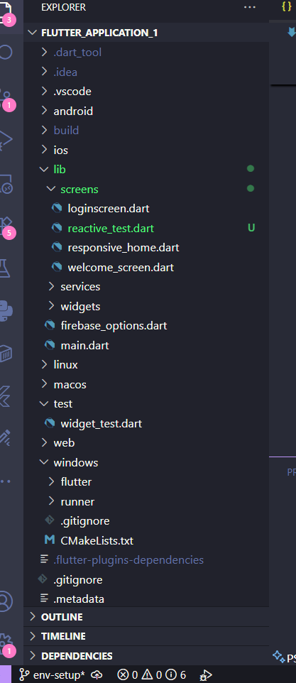

# Flutter Project Structure: ArtisanFlow

### Introduction
The Flutter directory structure is designed to separate platform-specific code (Android/iOS) from the core application logic (Dart). This ensures that we can write code once and deploy it across multiple devices.

### Folder & File Breakdown

| Folder/File | Purpose |
| :--- | :--- |
| `lib/` | **The Brain.** Contains all Dart code. This is where we spend 99% of our time. |
| `android/` | **Android Gateway.** Contains Gradle settings and the Manifest for Android-specific permissions. |
| `ios/` | **iOS Gateway.** Contains Xcode configuration files for Apple devices. |
| `assets/` | **Storage.** (Manually created) for images, icons, and custom fonts. |(yet to be created)
| `test/` | **Quality Control.** Where we write unit and widget tests to ensure the app doesn't break. |
| `pubspec.yaml` | **The Manager.** The configuration file where we add Firebase and other packages. |
| `.gitignore` | **The Filter.** Tells GitHub to ignore large build files and sensitive secrets. |

### Folder Hierarchy Diagram

### Reflection on Scalability
A clean folder structure allows multiple developers to work on the same project without "stepping on each other's toes." By separating logic into `services/` (like our Firebase code) and `screens/` (our UI), we can update the database without breaking the visual design.

### The Widget Tree Hierarchy:

MaterialApp (Root)

Scaffold (Layout Structure)

AppBar (Top Navigation)

Center (Alignment)

Column (Vertical Layout)

Text (Displays count)

SizedBox (Spacing)

Container (Reactive color box)

ElevatedButton (The trigger)