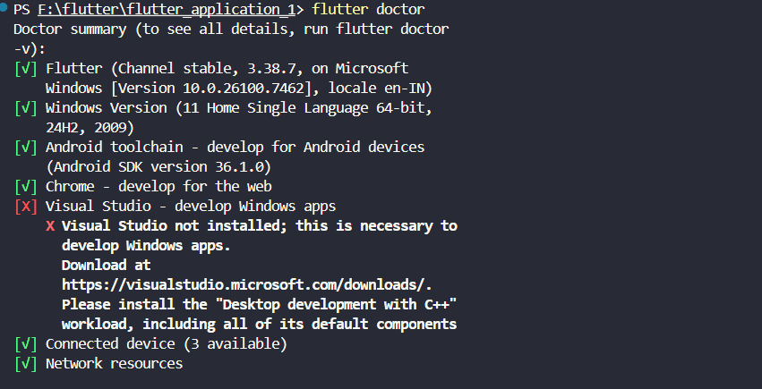
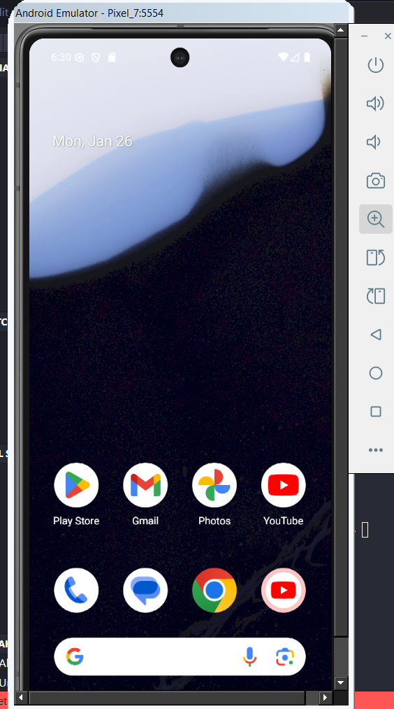

# flutter_application_1

A new Flutter project.

## Getting Started

This project is a starting point for a Flutter application.

A few resources to get you started if this is your first Flutter project:

- [Lab: Write your first Flutter app](https://docs.flutter.dev/get-started/codelab)
- [Cookbook: Useful Flutter samples](https://docs.flutter.dev/cookbook)

For help getting started with Flutter development, view the
[online documentation](https://docs.flutter.dev/), which offers tutorials,
samples, guidance on mobile development, and a full API reference.
# ArtisanFlow - Smart Enterprise for Local Artisans

## Project Overview
ArtisanFlow is a mobile-first solution designed to help local artisans in Tier-2/3 towns manage their inventory and showcase products in real-time.

## Folder Structure
- `lib/main.dart`: The entry point of the application.
- `lib/screens/`: Contains full-page UI components (e.g., WelcomeScreen).
- `lib/widgets/`: Reusable UI components to ensure a modular design.
- `lib/models/`: Reserved for data structures like Product and Order.
- `lib/services/`: Future home for Firebase Auth and Firestore logic.

## Setup Instructions
1. Install Flutter SDK.
2. Clone this repo: `git clone [YOUR_REPO_URL]`
3. Run `flutter pub get`.
4. Run the app: `flutter run`.

## Reflection
By using a modular folder structure, I can separate business logic from UI, making the app easier to scale. Learning about StatefulWidget was essential for handling the button interaction in this sprint.
# Flutter Environment Setup and First App Run

### Steps Followed:
1. **SDK Installation**: Installed Flutter SDK on `F:\flutter` and added the `bin` folder to the System PATH.
2. **Environment Configuration**: Set `ANDROID_HOME` to `F:\Android\Sdk` and fixed the VS Code Dart SDK path.
3. **Emulator Setup**: Created a Pixel 7 Virtual Device using Android Studio's AVD Manager.
4. **Firebase Integration**: Successfully linked the project using `flutterfire configure`.

### Setup Verification:
* **Flutter Doctor Output**:
* **Running App**: 

### Reflection:
The main challenge was managing storage constraints on the C: drive and redirecting all SDK components to the F: drive. This setup is crucial because it ensures that the app has a stable environment to communicate with Firebase for real-time data persistence.

## Folder Structure Exploration
I have documented the full architecture of the ArtisanFlow project. 
- See the full breakdown here: [PROJECT_STRUCTURE.md](./PROJECT_STRUCTURE.md)
- **Key Insight**: Understanding the `android/app/build.gradle` was vital for our Firebase MultiDex setup earlier in the sprint.

# Widget tree Hierarcy 
The Widget Tree Hierarchy:

MaterialApp (Root)

Scaffold (Layout Structure)

AppBar (Top Navigation)

Center (Alignment)

Column (Vertical Layout)

Text (Displays count)

SizedBox (Spacing)

Container (Reactive color box)

ElevatedButton (The trigger)

## stateless and stateful widget:

Stateless Widget: These are "immutable." Their properties cannot change once they are drawn. They are lightweight and great for performance when the UI is static.

Stateful Widget: These have a companion State object. When setState() is called, Flutter "re-builds" this specific part of the tree to show new data.

Performance Tip: We separate them so that when the favorite icon (Stateful) changes color, the Header (Stateless) doesn't have to waste energy rebuilding itself.fli